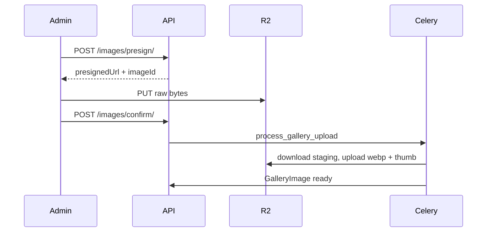

# Gallery API documentation

Branch-scoped photo albums stored in Cloudflare R2 (S3-compatible).

## Storage layout

```
school/{branch_code}/gallery/school/{album_slug}/{uuid}.webp
school/{branch_code}/gallery/classes/{batch_slug}/{album_slug}/{uuid}.webp
school/{branch_code}/gallery/.../thumbnail/{uuid}.webp
```

Database stores **object keys only**; API responses include signed or CDN URLs.

## Upload sequence



In `S3_MODE=sandbox`, use `POST /images/{id}/staging/` with multipart file instead of presigned PUT.

## Endpoints

| Method | Path | Role |
|--------|------|------|
| GET/POST | `/api/v1/gallery/albums/` | Admin |
| GET/PATCH/DELETE | `/api/v1/gallery/albums/{id}/` | Admin |
| POST | `/api/v1/gallery/albums/{id}/reorder-images/` | Admin |
| POST | `/api/v1/gallery/albums/{id}/set-cover/` | Admin |
| POST | `/api/v1/gallery/images/presign/` | Admin |
| POST | `/api/v1/gallery/images/confirm/` | Admin |
| POST | `/api/v1/gallery/images/bulk-delete/` | Admin |
| POST | `/api/v1/gallery/images/move/` | Admin |
| GET/POST | `/api/v1/gallery/images/{id}/status/` | Admin |
| GET | `/api/v1/gallery/albums/me/` | Student/Parent |
| GET | `/api/v1/gallery/albums/me/{id}/` | Student/Parent |

## Configuration

See `.env.example`: `R2_*`, `GALLERY_MAX_UPLOAD_BYTES`, `S3_MODE`.
